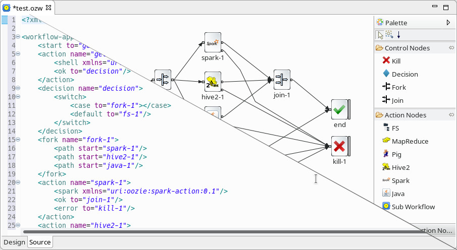

# Oozie Editor Plugin

Apache Oozie editor plugins for the famous IDEs like Eclipse and IntelliJ IDEA.
Currently, only Eclipse is supported.

## Oozie Eclipse Plugin

This version is a fork of project [mashin-io/oep](https://github.com/mashin-io/oep).
In this version I include a double view (design and source) of the workflow to be more
friendly the design of workflows.

## Contributing

Adding new features to the Eclipse plugin requires a knowledge about
Eclipse Graphical Editing Framework (GEF). 
[This wiki](https://github.com/mashin-io/oep/wiki/Eclipse-GEF-(Graphical-Editing-Framework)) 
can help getting started with GEF.
